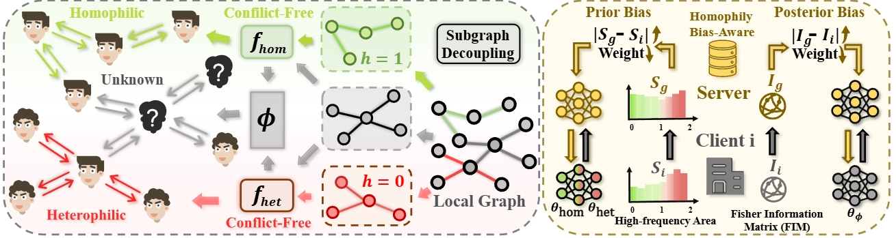

Greetings! I'm glad you're here to learn about my work! I'm a third-year undergraduate student from [School of Computer Science](https://cs.whu.edu.cn/), [Wuhan University](https://www.whu.edu.cn/). My research interests include federated learning, graph learning, AI for science, LLM agents.

## Publications & Preprints

  

    
  

  

    <a href="https://arxiv.org/pdf/2410.20105" style="color: #0969DA;"><b>FedSSP: Federated Graph Learning with Spectral Knowledge and Personalized Preference</b></a> 
    <b><u>Zihan Tan</u></b>, Guancheng Wan, Wenke Huang, Mang Ye 
    NeurIPS 2024
  

  

    
  

  

    <a href="https://www.cs.emory.edu/~jyang71/files/fedspa.pdf" style="color: #0969DA;"><b>FedSPA: Generalizable Federated Graph Learning under Homophily Heterogeneity</b></a> 
    <b><u>Zihan Tan</u></b>, Guancheng Wan, Wenke Huang, Guibin Zhang, He Li, Carl Yang, Mang Ye 
    CVPR 2025
  

  

    
  

  

    <a href="https://oakleytan.github.io/" style="color: #0969DA;"><b>S2FGL: Spacial Spectral Federated Graph Learning</b></a> 
    <b><u>Zihan Tan</u></b>, Suyuan Huang, Guancheng Wan, Wenke Huang, He Li, Mang Ye 
    Under Review 2025
  

